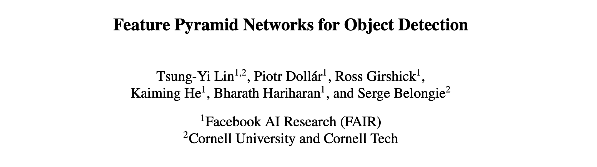

Feature Pyramid Network
===

- FPN on PyTorch: [torchvision.ops.FeaturePyramidNetwork](https://pytorch.org/vision/main/generated/torchvision.ops.FeaturePyramidNetwork.html)

- Prerequisites: Region Proposal Network (RPN); Region-based Detectors (e.g. Fast R-CNN); RoI Pooling 

{width=400}

{width=400}

- $\left \{ C_1,C_2,C_3,C_4 \right \} \to$ Output of the last residual blocks for conv2, conv3, conv4 and conv5 in ResNets
- $\left \{ 4,8,16,32 \right \} \to$ Strides of pixels with respect to the input image → i.e., $C_2$ will be 4 times smaller
- $\left \{ M_1,M_2,M_3,M_4 \right \} \to$ 
- $\left \{ P_1,P_2,P_3,P_4 \right \} \to$ Final set of feature maps corresponding to $\left \{ C_1,C_2,C_3,C_4 \right \}$

{width=400}

Steps:

1. Bottom-up pathway: Produce spatially coarser, but semantically stronger feature maps by adding strides to Conv2d
2. Top-down pathway & lateral connections