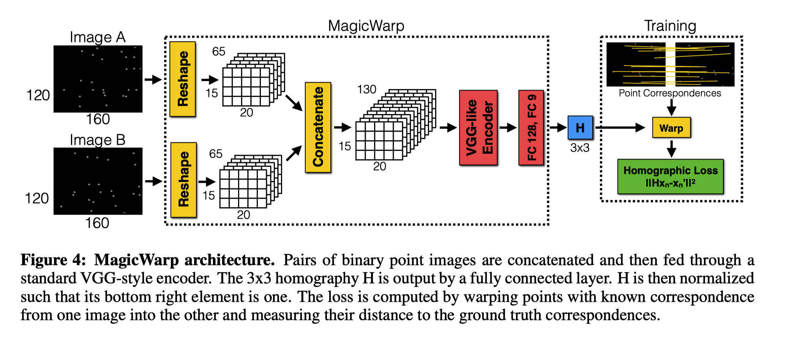
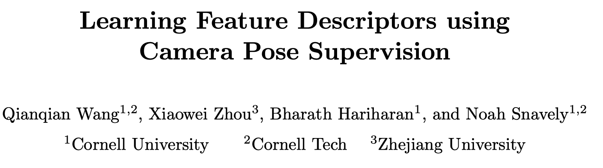
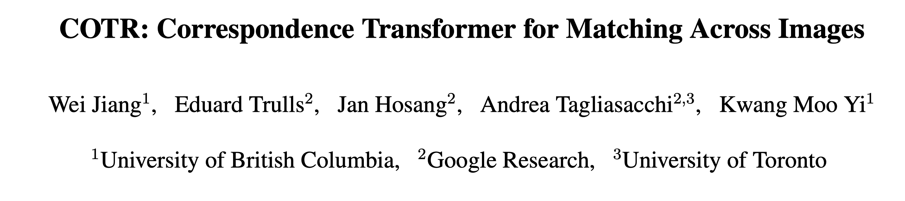
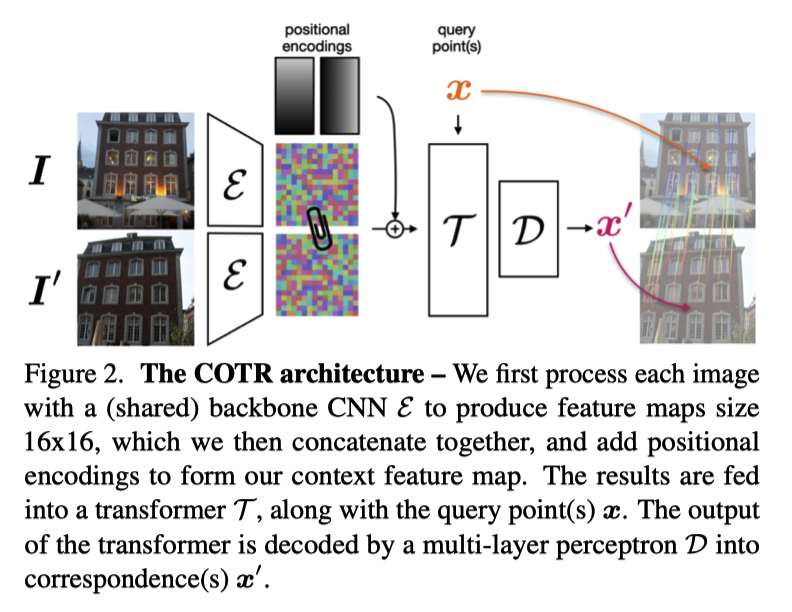

Feature Matching
===

Table 1. Important deep learning models for feature matching. 

| Published Month | Model Name                                             | Description                                                  | Organization |
| --------------- | ------------------------------------------------------ | ------------------------------------------------------------ | ------------ |
| 2017-07         | MagicPoint [[arXiv](https://arxiv.org/abs/1707.07410)] |                                                              |              |
| 2017-11         | Dog-AffNet-HardNet                                     |                                                              |              |
| 2017-12         | SuperPoint [[arXiv](https://arxiv.org/abs/1712.07629)] | Self-supervised; homographic adaptation                      |              |
| 2018-10         | NCNet [[arXiv]()]                                      | End-to-end CNN; weak supervision                             |              |
| 2019-05         | D2Net [[arXiv]()]                                      |                                                              |              |
| 2019-06         | R2D2 [[arXiv]()]                                       | Repeatable and reliable keypoints                            |              |
| 2019-11         | SuperGlue [[arXiv]()]                                  | Optimal transport; GNN                                       |              |
| 2020-04         | SparseNCNet [[arXiv]()]                                |                                                              |              |
| 2020-04         | CAPS [[arXiv]()]                                       | Relative camera poses; epipolar loss; coarse-to-fine architecture |              |
| 2020-12         | Patch2Pix [[arXiv]()]                                  | Detect-to-refine manner                                       |              |
| 2021-03         | COTR [[arXiv]()]                                       |                                                              |              |
| 2021-04         | LoFTR [[arXiv]()]                                      | Transformer                                                  |              |

MagicPoint
---

CAPS
---

- Challenge: Difficult to acquire at scale ground-truth correspondences between feature points for training
- Solution: weakly-supervised framework; relative camera poses
- Novelty
    - a new loss function
    - a new architecture
- Results: SOTA performance

- Differential matching layer

Probability distribution

$$
\mathcal{p} (x|x_{1},M_{1},M_{2})=\frac{\mathrm{exp} (M_{1}(x_{1})^{T}M_{2}(x))}{\Sigma_{y\in I_{2}}\mathrm{exp} (M_{1}(x_{1})^{T}M_{2}(y))}
$$

Expectation

$$
\hat{x}_{2}=h_{1\rightarrow2}(\mathbf{x}_{1})=\sum\limits_{x\in \mathbf{I_2} }x\cdot p(\mathbf{x} |\mathbf{x} _{1},M_{1},M_{2})
$$

- Coarse-to-fine architecture

Epipolar loss

- $I_1, I_2\rightarrow$ Image pairs
- $x_1\rightarrow$ Query point
- $\hat{x}_2\rightarrow$ Predicted correspondence
- $F\rightarrow$ Fundamental matrix
- $Fx_1\rightarrow$ ground-truth epipolar line
    - $x_2^T\cdot Fx_1=0\rightarrow$ $𝑥_1$ and $𝑥_2$ is a match
- $\mathcal{L}_{ep}\rightarrow$ Epipolar loss (Distance between $\hat{x}_2$ and $Fx_1$)
    - $\mathcal{L}_{ep}(x_1)=\mathrm{dist}(h_{1\rightarrow2}(x_1),Fx_1)$
- Green point $\rightarrow$ forward-backward corresponding point of $x_1$
- $\mathcal{L}_{cy}\rightarrow$ Cycle consistency loss (distance between $𝑥_1$ and green point)
    - $\mathcal{L}_{cy}(x_1)=\left\|h_{2\to1}\left(h_{1\to2}(x_1)\right)-x_1\right\|_2$
- $\mathcal{L} (\mathbf{I}_1,\mathbf{I}_2)
    =\sum_{i=1}^{n} \left [ 
    \mathcal{L}_{ep}(\mathbf{x} _1^i) +
    \lambda \mathcal{L}_{cy}(\mathbf{x} _1^i)
    \right ] \to$ Full training objective
    - $\mathbf{x} _1^i \to$ $i$-th training point in $I_1$
    - $\lambda\to$ A weight for the cycle consistency loss term

COTR
---

- Novelty: Transformer
- Inspirations: ViT; DETR

- (a) Find correspondences
- (b) Sparse matching: camera motion, multi-object motion, and object-pose changes.
- (c) Smooth correspondence map for stereo pairs

- $I, I^{\prime}\rightarrow$ Image pairs (256$\times$256 size)
- $\varepsilon \rightarrow$ CNN encoder
- $c=\left[\varepsilon\left(I\right),\varepsilon\left(I^{\prime}\right)\right]+\mathcal{p}\left(\Omega\right)\rightarrow$ Context feature map
    - $\mathcal{p}\rightarrow$ Linear positional concoding
        - $\Omega\rightarrow$ Coordinate function
        - For a given location $\mathbf{x}=\left[x,y\right]$
        - $\mathcal{P}(\mathbf{x})= \lbrack p_{1}(\mathbf{x}),p_{2}(\mathbf{x}),\cdots,p_{\frac{N}{4}}(\mathbf{x}) \rbrack$, $N=256$
        - $p_k(\mathbf{x})=[\sin(k \pi \mathbf{x}^T),\cos(k \pi \mathbf{x}^T)]$
- $T_{\varepsilon}\rightarrow$ Transformer encoder
- $T_D\rightarrow$ Transformer decoder
- $D\rightarrow$ Fully connected layer
- $x^{\prime}=F_{\Phi}(x|I,I^{\prime})=D(T_{D}(P(x),T_{\varepsilon}(c)))\rightarrow$ The corresponding point

