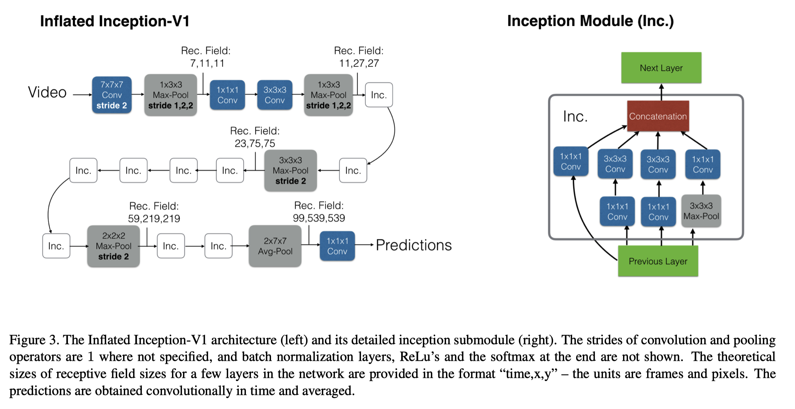
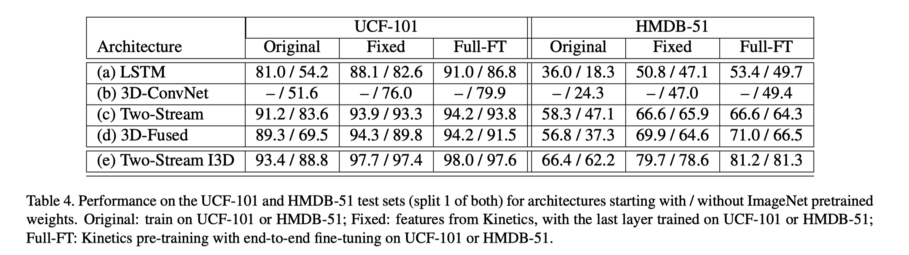
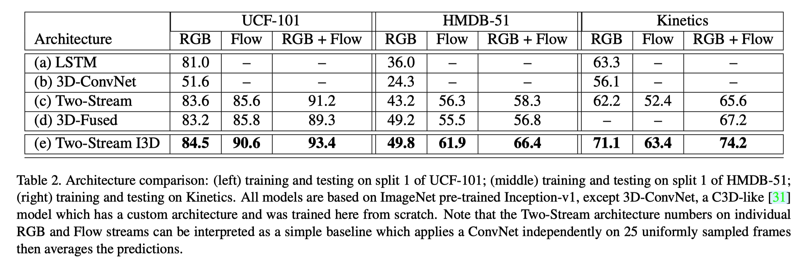

I3D (Inflated 3D CNN)
===

> 视频理解领域的另一片里程碑式论文

- Joao Carreira: [Perceiver](https://arxiv.org/abs/2103.03206)
- Andrew Zisserman: Two-Stream; VGG

{width="500"}

Main Contributions:

1. Inflated 3D CNN: directly use proven and pretrained 2D CNN networks, instead of designing new 3D networks
2. Kinetics dataset: A bigger and more complicated video datasets are needed, since accuracy on UCF-101 is already 98%.

意义：

- 大大降低了训练难度
- 大幅提升结果，刷爆了UCF-101和HMDB-51，以后大家就用K400
- 证明了2D→3D的可行性

1. CNN+LSTM
    - CNN提取特征，LSTM处理时序信息，本质上还是看成图像分类问题
    - 效果不好
2. 3D CNN
3. Two-Stream network
4. 3D-Fused Two-Stream: b+c
5. (Proposed) Two-Stream Inflated 3D

I3D Architecture
---

Results
---

### Transfer learning

1. 双流网络（RGB+Flow）总比单个RGB和Flow效果好→作者用了双流I3D
2. LSTM和3D网络效果普遍比较差
3. I3D达到了所有数据集SOTA

### Comparision with SOTA models

