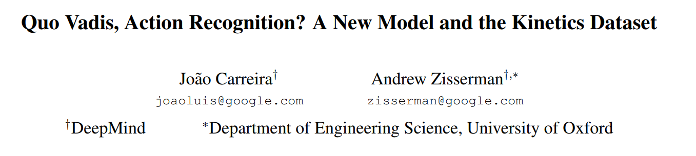

I3D (Inflated 3D CNN)
===

{width="500"}

Main Contributions:

1. Inflated 3D CNN: directly use proven and pretrained 2D CNN networks, instead of designing new 3D networks
2. Kinetics dataset: A bigger and more complicated video datasets are needed, since accuracy on UCF-101 is already 98%.

1. CNN+LSTM
2. 3D CNN
3. Two-Stream network
4. 3D-Fused Two-Stream: b+c
5. (Proposed) Two-Stream Inflated 3D