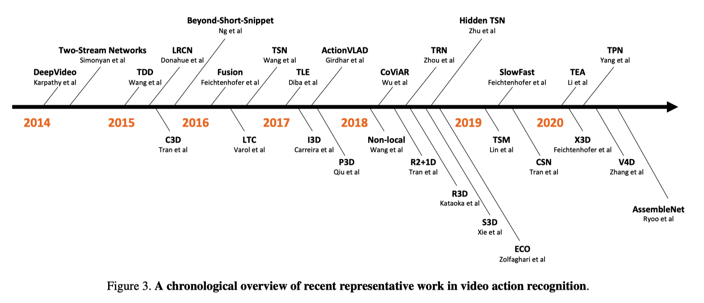

A Comprehensive Study of Deep Video Action Recognition
===

Published on December 2020 by AWS

Models
---

Video understanding models can be divided into 3 categories (2020 December).

- Hand-crafted
- Two-Stream
- 3D CNN

Datasets
---

