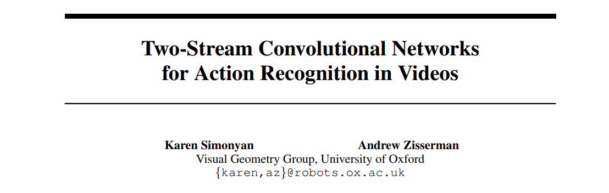
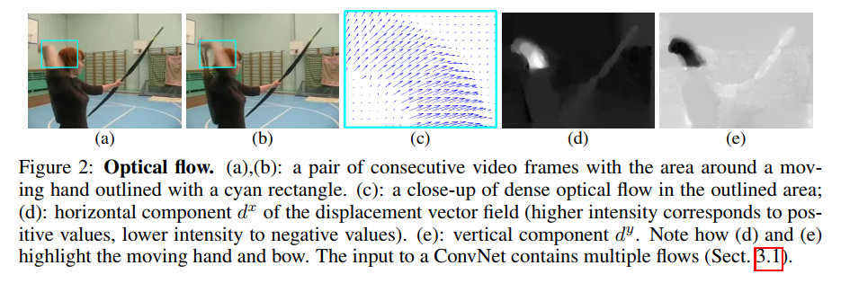
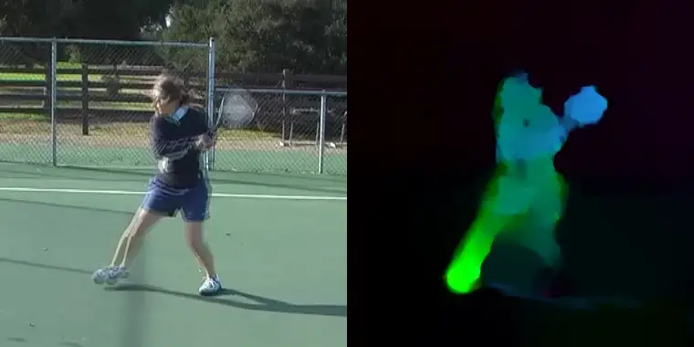
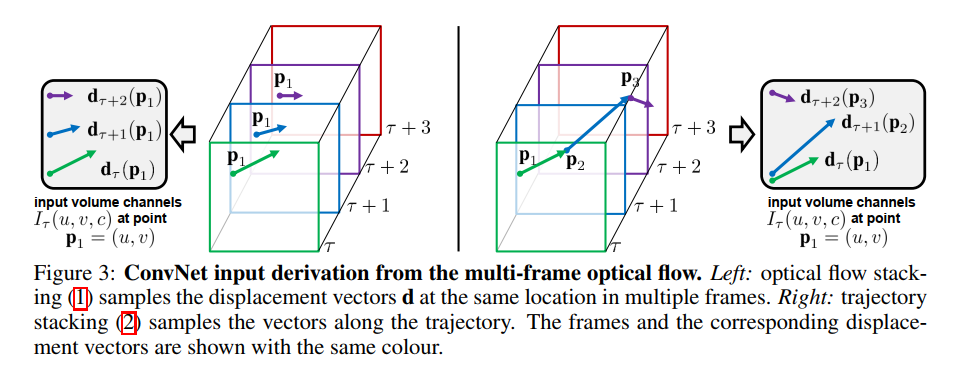

Two Stream
===

Two streams

1. Spatial
2. Temporal

1. Former frame
2. Later frame
3. Dense optical flow
4. Horizontal component
5. Vertical component

- Optical flow stacking
- Trajectory stacking