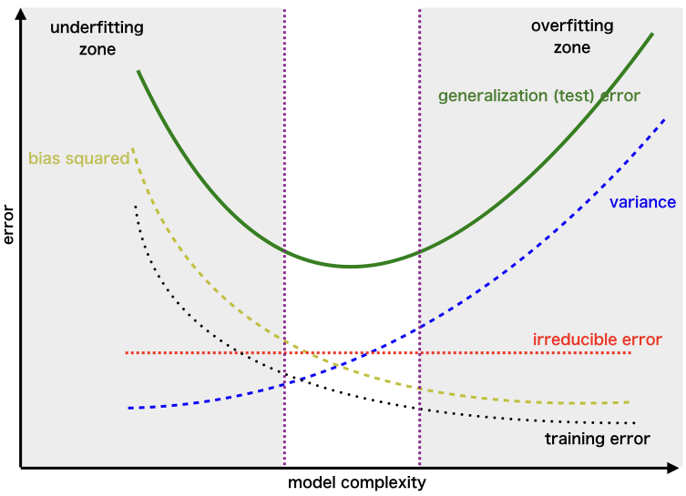
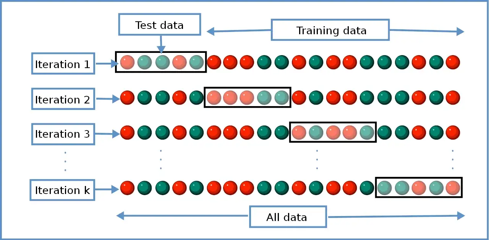

Concepts
===

## Gradient Descent

[Gradient Descent Algorithms (Continued) | Lecture 2 (Part 1) | Applied Deep Learning](https://www.youtube.com/watch?v=eFSqAAuxaf4&list=PLoEMreTa9CNmuxQeIKWaz7AVFd_ZeAcy4&index=5&t=46s)

## Bias Variance Trade-off

|  | Bias | Variance |
| --- | --- | --- |
| Underfitting | high | low |
| Overfitting | low | high |

### Overfitting

How to avoid overfitting

1. Hold-out
2. Cross-validation
3. Data augmentation
4. Feature selection
5. L1 / L2 regularization
6. Remove layers / number of units per layer
7. Dropout
8. Early stopping

## Regularization

Cross Validation
---

[Medium: What is K-fold Cross Validation? - 2022.07](https://towardsdatascience.com/what-is-k-fold-cross-validation-5a7bb241d82f)

