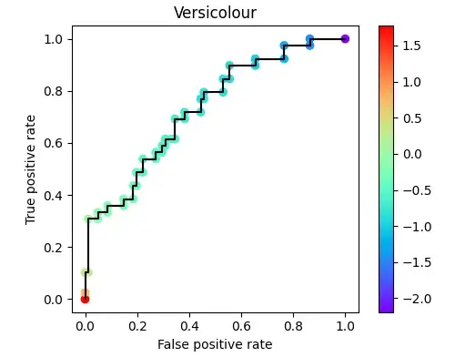
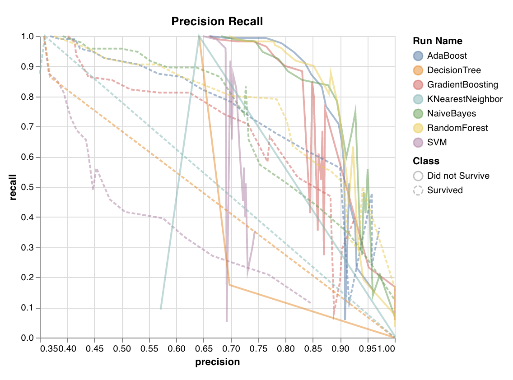

# Metrics

## Classification

Reference

- [Medium: 10 Must-Know Classification Metrics for Machine Learning](https://towardsdatascience.com/10-must-know-classification-metrics-for-machine-learning-2ce3a4ad256e)

Category

1. Classification accuracy
2. Confusion matrix
3. Precision
4. Recall
5. F1 score
6. Log loss
7. Sensitivity
8. Specificity
9. ROC curve (Receiver Operating Characteristic)
10. AUC (Area Under The Curve)

### Confusion Matrix

{width=400}

source: [What is Confusion Matrix and Advanced Classification Metrics?](https://manisha-sirsat.blogspot.com/2019/04/confusion-matrix.html)

$$
\mathrm{Precision} = \frac {\mathrm{TP}}{\mathrm{TP+FP}}
$$

$$
\mathrm{Recall}=\frac{\mathrm{TP}}{\mathrm{TP+FN}}
$$

$$
\mathrm{Specificity}=\frac{\mathrm{TN}}{\mathrm{TN+FP}}
$$

$$
\mathrm{Negative \ Predictive \ Value}=\frac{\mathrm{TN}}{\mathrm{TN+FN}}
$$

$$
\mathrm{Accuracy}=\frac{\mathrm{TP+TN} }{\mathrm{TP+TN+FP+FN}}
$$

The $F_1$ score is the harmonic average of precision and recall.

$$
F_1=\frac{1}{\frac{1}{\mathrm{Recall} }+\frac{1}{\mathrm{Precision}}}=2\times \frac{\mathrm{Precision \times Recall}}{\mathrm{Precision+Recall} }=\frac{\mathrm{TP} }{\mathrm{TP+\frac{1}{2}(FP+FN)}}
$$

- TPR
- FPR = 1 - specificity

- False Positive: *Type I Error*
- False Negative: *Type II Error*

```python
# Get precisions and recalls
from sklearn.metrics import precision_recall_curve
precision, recall, thresholds = precision_recall_curve(y_true, y_scores)
```

```python
# Get TPR and FPR
from sklearn.metrics import roc_curve
fpr, tpr, thresholds = roc_curve(y_train_5, y_scores)
```

### ROC curve

{width="400"}

| Library          | API                               | Reference                                                    |
| ---------------- | --------------------------------- | ------------------------------------------------------------ |
| sklearn          | `sklearn.metrics.RocCurveDisplay` | [link](https://scikit-learn.org/stable/modules/generated/sklearn.metrics.RocCurveDisplay.html) |
| Yellowbrick      | `yellowbrick.classifier.ROCAUC`   | [link](https://www.scikit-yb.org/en/latest/api/classifier/rocauc.html) |
| Weights & Biases | `wandb.sklearn.plot_roc`          | [link](https://docs.wandb.ai/guides/integrations/scikit#roc) |
|                  | `plot_roc_curve`                  | [link](https://github.com/ageron/handson-ml2/blob/master/03_classification.ipynb) |

```python
def plot_roc_curve(recalls, precisions, fpr, tpr, label=None):
    """ROC curve."""
    plt.figure(figsize=(8, 6))

    # If we want to compare two models' roc curve. Add few lines like this.
    plt.plot(fpr, tpr, "b-", linewidth=2, label=label)  # ROC curve
    recall_90_precision = recalls[np.argmax(precisions >= 0.90)]
    fpr_90 = fpr[np.argmax(tpr >= recall_90_precision)]
    plt.plot([fpr_90, fpr_90], [0.0, recall_90_precision], "r:")
    plt.plot([0.0, fpr_90], [recall_90_precision, recall_90_precision], "r:")
    plt.plot([fpr_90], [recall_90_precision], "ro")  # Red line
    plt.text(fpr_90 + 0.02,recall_90_precision,
             f"A (precision=0.9, recall={recall_90_precision:.2f})",)  # Point A
    # General settings
    plt.plot([0, 1], [0, 1], "k--")  # diagonal line: random classifier
    plt.axis([0, 1, 0, 1])
    plt.legend()
    plt.xlabel("False Positive Rate (Fall-Out)", fontsize=16)
    plt.ylabel("True Positive Rate (Recall)", fontsize=16)
    plt.grid(True)
    plt.title("ROC Curve. Point A highlights the chosen ratio")
    plt.show()
```

[Medium: You deserve a better ROC curve - 2022.11](https://towardsdatascience.com/you-deserve-a-better-roc-curve-970617528ce8)

{width="400"}

### Precision-Recall curve

{width="400"}

| Library          | API                                           | Reference                                                    |
| ---------------- | --------------------------------------------- | ------------------------------------------------------------ |
| sklearn          | `sklearn.metrics.PrecisionRecallDisplay`      | [link](https://scikit-learn.org/stable/modules/generated/sklearn.metrics.PrecisionRecallDisplay.html) |
| Yellowbrick      | `yellowbrick.classifier.PrecisionRecallCurve` | [link](https://www.scikit-yb.org/en/latest/api/classifier/prcurve.html) |
| Weights & Biases | `wandb.sklearn.plot_precision_recall`         | [link](https://docs.wandb.ai/guides/integrations/scikit#precision-recall-curve) |
|                  | `plot_precision_vs_recall`                    | [link](https://github.com/ageron/handson-ml2/blob/master/03_classification.ipynb) |

```python
def plot_precision_vs_recall(precisions, recalls):
    """Precision vs Recall."""
    plt.figure(figsize=(8, 6))
    plt.plot(recalls, precisions, "b-", linewidth=2)
    plt.xlabel("Recall", fontsize=16)
    plt.ylabel("Precision", fontsize=16)
    plt.axis([0, 1, 0, 1])
    plt.title("Precision vs Recall. Point A shows when precision=0.9")
    plt.grid(True)
    recall_90_precision = recalls[np.argmax(precisions >= 0.90)]
    plt.plot([recall_90_precision, recall_90_precision], [0.0, 0.9], "r:")
    plt.plot([0.0, recall_90_precision], [0.9, 0.9], "r:")
    plt.plot([recall_90_precision], [0.9], "ro")
    plt.text(recall_90_precision, 0.93, "A", fontsize=16)
    plt.show()
```

{width="400"}

## Regression

[Evaluation Metrics in Machine Learning 101](https://medium.com/@anushka.datascoop/evaluation-metrics-in-machine-learning-101-accc3cd35af9)

1. RMSE (Root Mean Square Error)
2. MAE
3. MAPE
4. $R^2$
5. Adjusted $R^2$

$$
\mathrm{MSE} (\mathrm{\mathbf{X}},h_\theta)=\frac{1}{m}\sum\limits_{i=1}^{m}({\mathbf{\theta^{\top}}x} ^{(i)}-y^{(i)})^{2}
$$

