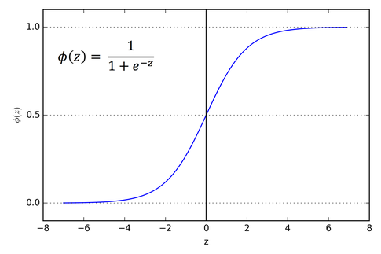

# Supervised Learning

Regression
---

### Linear Regression

$$
{\hat{y}=\theta_{0}+\theta_{1}x_{1}}+{\theta_{2}x_{2}}+\dots+{\theta_{n}x_{n}}
$$

$$
Obj(\theta)=L(\theta)+\Omega(\theta)
$$

- Objective function
- Loss function
- Regularization term (a.k.a penalty term)

| Regularization method    | Name       |
| ------------------------ | ---------- |
| L1 regularization        | Lasso      |
| L2 regularization        | Ridge      |
| L1 and L2 regularization | ElasticNet |

- [Medium: L1 L2 Regularization](https://medium.datadriveninvestor.com/l1-l2-regularization-7f1b4fe948f2)

#### Ridge regression

#### Lasso regression

Classification
---

### Logistic Regression

> Binary classification algorithm

Sigmoid function

$$
\sigma(x)=\frac{1}{1+e^{-x}}=1-\sigma(-x)
$$

$$
{\sigma}'=\sigma(1-\sigma )
$$

### KNN

> Supervised classification algorithm

- [Medium: 9 Distance Measures in Data Science](https://towardsdatascience.com/9-distance-measures-in-data-science-918109d069fa)

Minkowski distance

$$
d_{minkowski}(p,\ q)=\left ( \sum\limits_{i=1}^{n}|p_{i}-q_{i} | ^ {a} \right ) ^ {1/a},\ a \geq 1
$$

Euclidean Distance (a=2)

$$
d_{Euclidean}(p,\ q)=\sqrt{\sum\limits_{i=1}^{n}\left(p_{i}-q_{i}\right)^{2}}
$$

Manhattan Distance (a=1)

$$
d_{Manhattan}(p,\ q)=\left \| p-q \right \|_1={\sum\limits_{i=1}^{n}\left|p_{i}-q_{i}\right|}
$$

### SVM

### Naïve Bayes