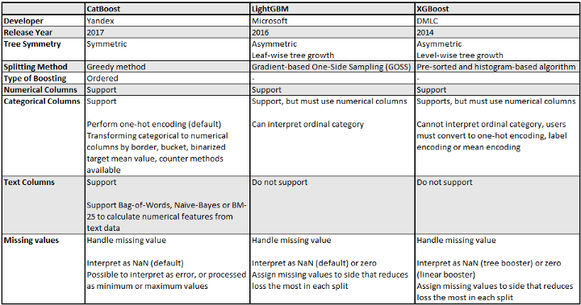

Trees
===

Decision Tree
---

Random Forest
---

> Bagging ensemble of decision trees

[Random Forest Algorithm Explained in Less Than 5 Minutes](https://medium.com/@techynilesh/random-forest-algorithm-explained-in-less-than-5-minutes-a433dc295f94)

XGBoost
---

LightGBM
---

[XGBoost vs LightGBM: How Are They Different - neptune.ai](https://neptune.ai/blog/xgboost-vs-lightgbm)

- [CatBoost vs. LightGBM vs. XGBoost](https://towardsdatascience.com/catboost-vs-lightgbm-vs-xgboost-c80f40662924)
- [XGBoost, Light GBM and CatBoost](https://medium.com/octave-john-keells-group/xgboost-light-gbm-and-catboost-a-comparison-of-decision-tree-algorithms-and-applications-to-a-f1d2d376d89c)