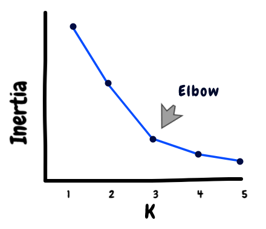
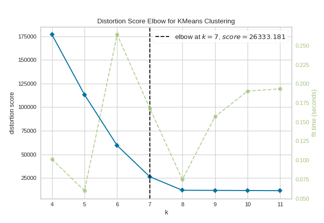
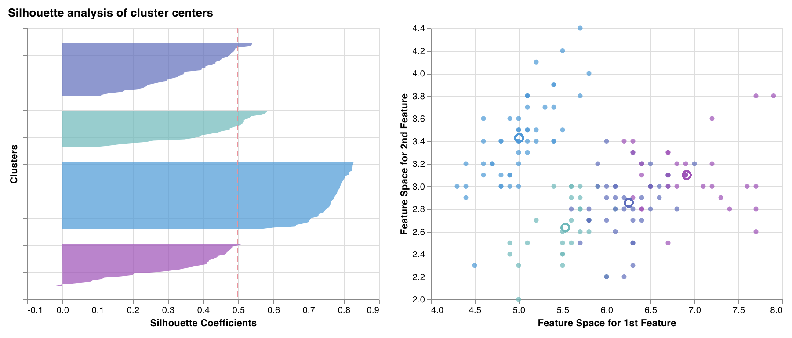

# Unsupervised Learning

## PCA

Principal Component Analysis

## K-MEANS

Reference

- [Medium: K-means Clustering: Algorithm, Applications, Evaluation Methods, and Drawbacks](https://towardsdatascience.com/k-means-clustering-algorithm-applications-evaluation-methods-and-drawbacks-aa03e644b48a)

Variants

| Variants           | API                                        | Reference                                                    |
| ------------------ | ------------------------------------------ | ------------------------------------------------------------ |
| K-Means            | `sklearn.cluster.KMeans`                   | [link](https://scikit-learn.org/stable/modules/generated/sklearn.cluster.KMeans.html) |
| K-Means++          | `sklearn.cluster.KMeans(init='k-means++')` |                                                              |
| Mini-batch K-Means | `sklearn.cluster.MiniBatchKMeans`          | [link](https://scikit-learn.org/stable/modules/generated/sklearn.cluster.MiniBatchKMeans.html) |

{width=400}

### Elbow method - Inertia

> **Inertia**: Intuitively, inertia tells how far away the points within a cluster are. Therefore, a small of inertia is aimed for. The range of inertia’s value starts from zero and goes up.

| Library          | API                                    | Reference                                                    |
| ---------------- | -------------------------------------- | ------------------------------------------------------------ |
| Yellowbrick      | `yellowbrick.cluster.KElbowVisualizer` | [link](https://www.scikit-yb.org/en/latest/api/cluster/elbow.html) |
| Weights & Biases | `wandb.sklearn.plot_elbow_curve`       | [link](https://docs.wandb.ai/guides/integrations/scikit#elbow-plot) |

{width=400}

### Silhouette score

> Measures & plots how close each point in one cluster is to points in the neighboring clusters. The thickness of the clusters corresponds to the cluster size. The vertical line represents the average silhouette score of all the points.

{width=400}

| Library          | API                                        | Reference                                                    |
| ---------------- | ------------------------------------------ | ------------------------------------------------------------ |
| Yellowbrick      | `yellowbrick.cluster.SilhouetteVisualizer` | [link](https://www.scikit-yb.org/en/latest/api/cluster/silhouette.html) |
| Weights & Biases | `wandb.sklearn.plot_silhouette`            | [link](https://docs.wandb.ai/guides/integrations/scikit#silhouette-plot) |

{width=600}