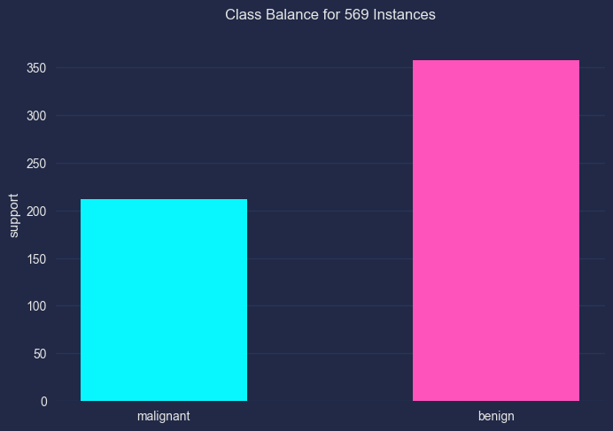

Imbalanced Data
===

|                  | Description                                      | Documentation                                          | Home                                                         | PyPI                                               |
| ---------------- | ------------------------------------------------ | ------------------------------------------------------ | ------------------------------------------------------------ | -------------------------------------------------- |
| imbalanced-learn | Deal with classification with imbalanced classes | [Docs](https://imbalanced-learn.org/stable/index.html) | [GitHub](https://github.com/scikit-learn-contrib/imbalanced-learn) | [PyPI](https://pypi.org/project/imbalanced-learn/) |

[Medium: How to Handle Imbalanced Data in ML Classification using Python - 2022.09](https://pub.towardsai.net/important-techniques-to-handle-imbalanced-data-in-machine-learning-python-3b0cb44a12bf)

- Over-sampling
- Under-sampling
- SMOTE (Synthetic Minority Oversampling Technique)

imbalanced-learn
---


Plot Imbalance
---

01 - Imports

```python
import matplotlib.pyplot as plt
import mplcyberpunk
plt.style.use("cyberpunk")
```

02- Data preparation

```python
from sklearn.datasets import load_breast_cancer
cancer = load_breast_cancer()
classes = cancer.target_names
X = cancer.data
y = cancer.target
```

03 - Plot Imbalanced data

```python
from yellowbrick.target import ClassBalance
visualizer = ClassBalance(labels=classes)
visualizer.fit(y)
visualizer.show()
```

{width=400}
