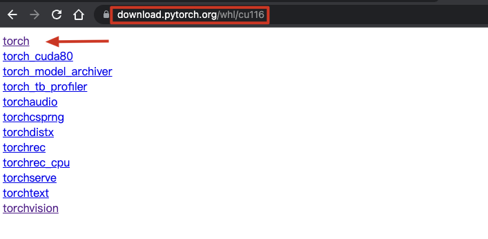
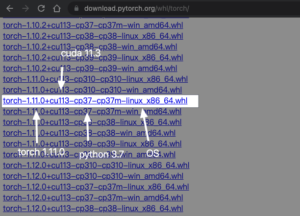

PyTorch
===

|         | Description   | Documentation                                      | Home                                         | PyPI                                    |
| ------- | ------------- | -------------------------------------------------- | -------------------------------------------- | --------------------------------------- |
| PyTorch | Deep Learning | [Docs](https://pytorch.org/docs/stable/index.html) | [GitHub](https://github.com/pytorch/pytorch) | [PyPI](https://pypi.org/project/torch/) |

- [Awesome Pytorch list](https://github.com/bharathgs/Awesome-pytorch-list)
- [torchtyping](https://github.com/patrick-kidger/torchtyping)

Installation

1. Navigate to PyTorch download wheel [webpage](https://download.pytorch.org/whl/cu116)
    {width=400}

2. Choose the proper version, and copy link address
    {width=400}

3. Install

    ```shell
    pip install LINK_ADDRESS
    ```

