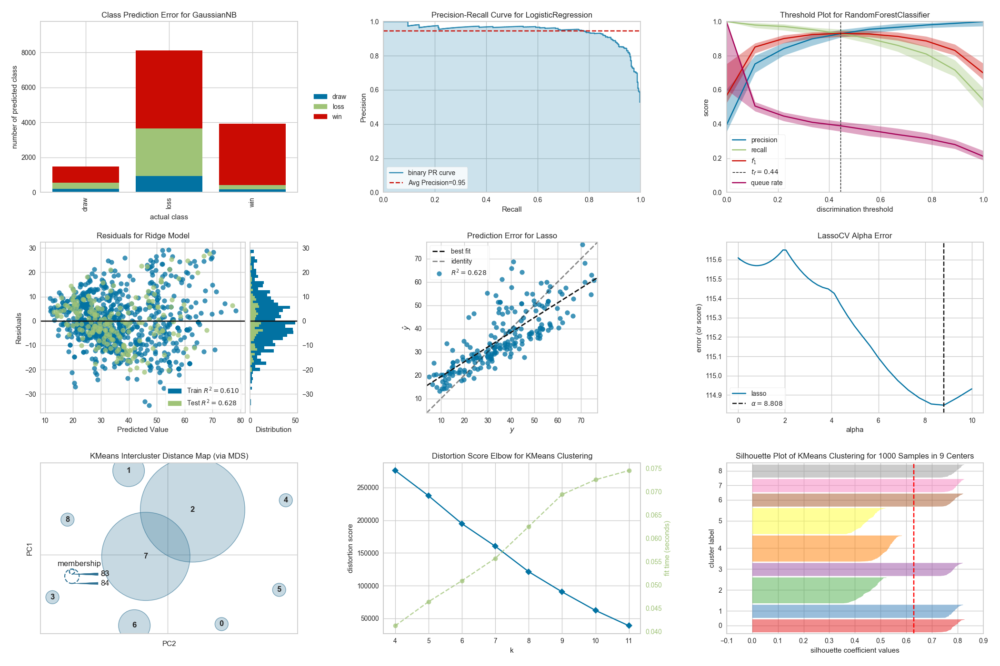

Visualization
===

|             | Description                    | Documentation                                    | Repository                                                | PyPI                                          |
| ----------- | ------------------------------ | ------------------------------------------------ | --------------------------------------------------------- | --------------------------------------------- |
| Matplotlib  | Python Visualization           | [Docs](https://matplotlib.org/stable/index.html) | [GitHub](https://github.com/matplotlib/matplotlib)        | [PyPI](https://pypi.org/project/matplotlib/)  |
| Seaborn     | Statistical Data Visualization | [Docs](https://seaborn.pydata.org/)              | [GitHub](https://github.com/mwaskom/seaborn)              | [PyPI](https://pypi.org/project/seaborn/)     |
| Yellowbrick | ML Visualization               | [Docs](https://www.scikit-yb.org/en/latest/)     | [GitHub](https://github.com/DistrictDataLabs/yellowbrick) | [PyPI](https://pypi.org/project/yellowbrick/) |

Matplotlib
---

```python
import matplotlib.pyplot as plt
```

| API                            | Arguments                   | Description |
| ------------------------------ | --------------------------- | ----------- |
| plt.annotate(text, xy, xytext) | text<br/>xy<br/>xytext<br/> |             |

Themes

- [Dracula](https://draculatheme.com/matplotlib)
- [Cyber Punk](https://github.com/dhaitz/mplcyberpunk) ⭐️

{width=400}

Seaborn
---

```python
import seaborn as sns
```

Yellowbrick
---



- [10 Amazing Machine Learning Visualizations You Should Know in 2023](https://towardsdatascience.com/10-amazing-machine-learning-visualizations-you-should-know-in-2023-528282940582)
