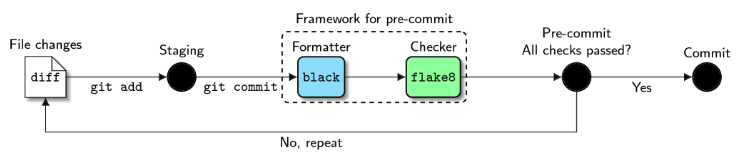

Git & GitHub
===

Git
---

- [菜鸟教程：Git教程](https://www.runoob.com/git/git-tutorial.html)

|            |                                     |                                                              |
| ---------- | ----------------------------------- | ------------------------------------------------------------ |
| `.gitkeep` | Track and push empty folders in Git | [What is .gitkeep? How to Track and Push Empty Folders in Git](https://www.freecodecamp.org/news/what-is-gitkeep/) |

GitHub
---

Awesome GitHub Profile README: [](https://github.com/abhisheknaiidu/awesome-github-profile-readme)

Pre-commit
---

|            | Description      | Documentation                                   | Home                                               | PyPI                                         |
| ---------- | ---------------- | ----------------------------------------------- | -------------------------------------------------- | -------------------------------------------- |
| pre-commit | Pre-commit hooks | [Docs](https://pre-commit.com/index.html)<br/>[Supported Hooks](https://pre-commit.com/hooks.html) | [GitHub](https://github.com/pre-commit/pre-commit) | [PyPI](https://pypi.org/project/pre-commit/) |
| black      | Code formatter   | [Docs](https://black.readthedocs.io/en/stable/) | [GitHub](https://github.com/psf/black)             | [PyPI](https://pypi.org/project/black/)      |
| flake8     | Style checker | [Docs](https://flake8.pycqa.org/en/latest/)     | [GitHub](https://github.com/PyCQA/flake8)          | [PyPI](https://pypi.org/project/flake8/)     |
| isort | Imports sorting | [Docs](https://pycqa.github.io/isort/) | [GitHub](https://github.com/PyCQA/isort) | [PyPI](https://pypi.org/project/isort/) |
| pylint | Static code analyser | [Docs](https://pylint.pycqa.org/en/latest/) | [GitHub](https://github.com/PyCQA/pylint) | [PyPI](https://pypi.org/project/pylint/) |
| mypy | Typing correctness | [Docs](https://mypy.readthedocs.io/en/stable/) | [GitHub](https://github.com/python/mypy) | [PyPI](https://pypi.org/project/mypy/) |
| shellcheck | Shell script static analysis |  | [GitHub](https://github.com/koalaman/shellcheck) |  |
| interrogate | Check missing docstrings | [Docs](https://interrogate.readthedocs.io/en/latest/) | [GitHub](https://github.com/econchick/interrogate) | [PyPI](https://pypi.org/project/interrogate/) |

Resource

- [Automate Python workflow using pre-commits: black and flake8 - Lj Miranda](https://ljvmiranda921.github.io/notebook/2018/06/21/precommits-using-black-and-flake8/)
    
- [4 pre-commit Plugins to Automate Code Reviewing and Formatting in Python - Khuyen Tran](https://medium.com/towards-data-science/4-pre-commit-plugins-to-automate-code-reviewing-and-formatting-in-python-c80c6d2e9f5)

### pre-commit

`.pre-commit-config.yaml`

```yaml
repos:
# a set of useful Python-based pre-commit hooks
-   repo: https://github.com/pre-commit/pre-commit-hooks
    rev: v4.3.0
    hooks:
      # supported hooks: https://pre-commit.com/hooks.html
    - id: trailing-whitespace
    - id: check-toml
    - id: check-yaml
    - id: check-json
    - id: check-merge-conflict
      args: ['--assume-in-merge']
    - id: check-added-large-files
      args: ['--maxkb=10240']
    - id: debug-statements
    - id: detect-private-key
```

| Commands                   |                              |
| -------------------------- | ---------------------------- |
| pre-commit --version       |                              |
| pre-commit install         | Install the git hook scripts |
| pre-commit run --all-files |                              |
| pre-commit autoupdate      |                              |

### black

`.pre-commit-config.yaml`

```yaml
repos:
-   repo: https://github.com/ambv/black
    rev: 22.10.0
    hooks:
    - id: black
```

`pyproject.toml`

```toml
[tool.black]
line-length = 120
include = '\.pyi?$'
exclude = '''
/(
	\.git
| \.hg
| \.mypy_cache
| \.tox
| \.venv
| _build
| buck-out
| build
)/
'''
```

### flake8

`.pre-commit-config.yaml`

```yaml
repos:
-   repo: https://gitlab.com/pycqa/flake8
    rev: 3.9.2
    hooks:
    - id: flake8
```

Add `.flake`

```toml
[flake8]
ignore = E203, E266, E501, W503, F403, F401
max-line-length = 120
max-complexity = 18
select = B,C,E,F,W,T4,B9
```

### isort

`.pre-commit-config.yaml`

```yaml
repos:
-   repo: https://github.com/timothycrosley/isort
    rev: 5.10.1
    hooks:
    -   id: isort
```

### pylint

`.pre-commit-config.yaml`

```yaml
repos:
- repo: local
  hooks:
    - id: pylint
      name: pylint
      entry: pylint
      language: system
      types: [python]
      args:
        [
          "-rn", # Only display messages
          "-sn", # Don't display the score
        ]
```

### myру

`.pre-commit-config.yaml`

```yaml
repos:
```

### shellcheck

`.pre-commit-config.yaml`

```yaml
repos:
-   repo: https://github.com/shellcheck-py/shellcheck-py
    rev: v0.8.0.4
    hooks:
      - id: shellcheck
```

### interrogate

`.pre-commit-config.yaml`
